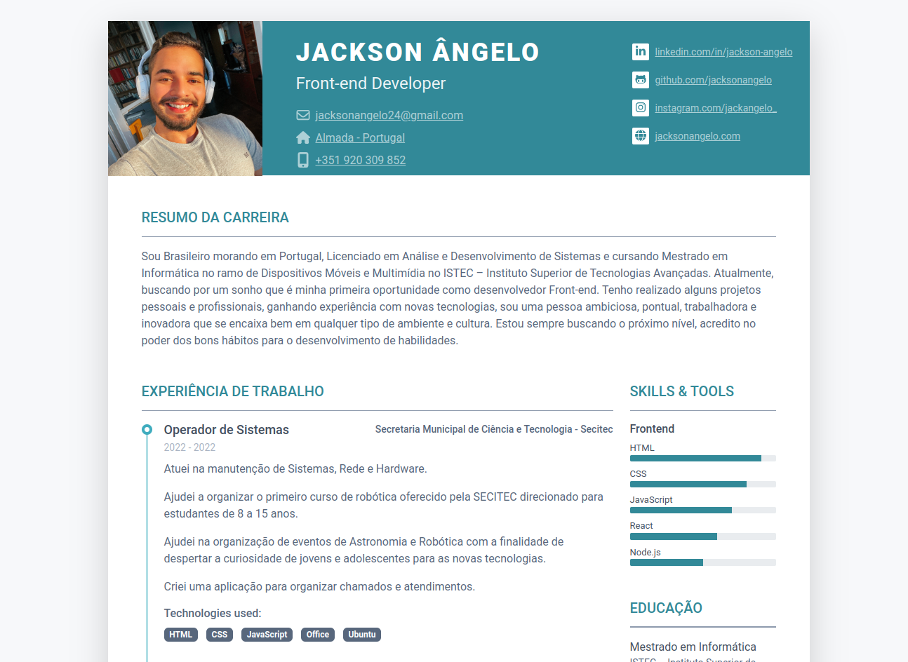

<h1 align="center"> Currículo Profissional </h1>

Modelo gratuito de currículo/CV Bootstrap 5 para Desenvolvedores Web

  <a href="#-tecnologias">Tecnologias</a>&nbsp;&nbsp;&nbsp;|&nbsp;&nbsp;&nbsp;
  <a href="#-projeto">Projeto</a>&nbsp;&nbsp;&nbsp;|&nbsp;&nbsp;&nbsp;
  <a href="#-layout">Layout</a>&nbsp;&nbsp;&nbsp;|&nbsp;&nbsp;&nbsp;
  <a href="#memo-licença">Licença</a>

  

 

  

## 🚀 Tecnologias

Esse projeto foi desenvolvido com as seguintes tecnologias:

- HTML e CSS
- Bootstrap 5
- JavaScript
- Git e Github

## 💻 Projeto

Ideia de um Currículo para fins Profissionais.

## 🔖 Layout

Você pode visualizar o layout do projeto através [DESSE LINK](https://themes.3rdwavemedia.com/freebies/).

## :memo: Licença

Este modelo é 100% GRATUITO, desde que você mantenha o link de atribuição do rodapé. Você não tem o direito de revender, sublicenciar ou redistribuir (mesmo gratuitamente) o modelo sozinho ou como um anexo separado de qualquer um de seus trabalhos.

---

Designed with love by:[Xiaoying Riley for developers](https://themes.3rdwavemedia.com/).
